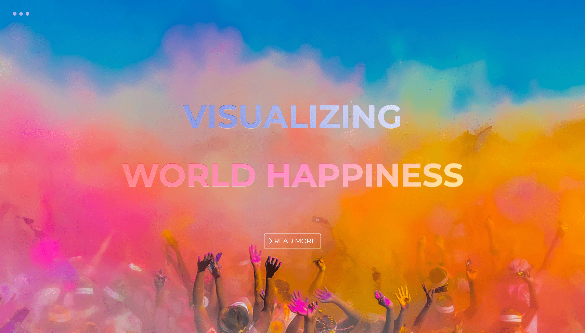

# world-happiness

## DATA ANALYSIS & VISUALIZATION PROJECT

  

  
Interactive choropleth map, charts, and data table built based on the 2019 World Happiness Report, a landmark survey of the state of global happiness produced by the United Nations Sustainable Development Solutions Network.

The visualizations are currently deployed at [https://petitspoissons.github.io/world-happiness](https://petitspoissons.github.io/world-happiness/).
  

### Technologies Used:

**For data analysis:**  
Python, Jupyter Notebook, Pandas, SQLite, GeoJSON
  
**For rendering:**  
HTML5, CSS3, Bootstrap, JavaScript, d3.js, Leaflet.js, Mailchimp
